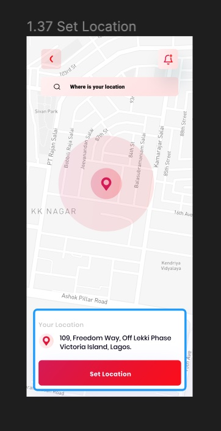

# Getir Android Kotlin Bootcamp w2 v2 Assignment

## What Works
* The UI Wireframing is done.
* Google Maps API is implemented.
* Locationa and Permission related operations are done.
* On activity create map's location would be the user's current location. 🚀

## What Needs More Work
* UI is not completed yet.
* Adress change and the written form of address is not reflecting in the UI
* Search box is not functional yer.

## Ekran Görüntüleri

 

### Yapılacaklar

1 - Set Location sayfasının tasarımının kodlanması

2- Sayfa açıldığında haritada mevcut konuma yönlendirilmesi
